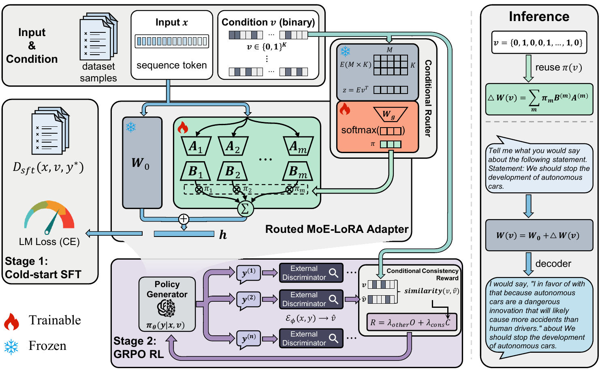

# V-RoLoRA

[](https://aclanthology.org/2026.findings-acl.1377/)
[](LICENSE)

Official implementation of **V-RoLoRA: RLVR-Driven MoE Routing for Steerable Pluralistic Alignment**, published in Findings of ACL 2026.

Jing Wang, Yaomin Wu, Yinglin Wang, and Yitong Yang

Shanghai University of Finance and Economics

## Overview

V-RoLoRA controls language-model behavior with a discrete, multi-dimensional value or moral vector. It combines:

1. a pool of LoRA experts;
2. a fixed sparse Gaussian projection of the condition vector;
3. a shared trainable router that produces sample-level expert weights; and
4. RLVR post-training with GRPO, using a multi-label discriminator as a conditional-consistency verifier.

[](assets/frame.pdf)

*Overview of the V-RoLoRA framework. Click the figure to open the vector PDF.*

The router is conditioned once per sample and its expert weights are broadcast across token positions, providing sequence-consistent control. The backbone and condition projection remain frozen; the expert adapters and router are optimized during supervised cold-start training and RLVR.

## Repository contents

```text
configs/                 DeepSpeed configuration
examples/                Relative-path SFT and GRPO launch scripts
src/vrolora/peft/        V-RoLoRA adapter, router, and PEFT registration
src/vrolora/data.py      SFT/GRPO dataset formatting
src/vrolora/rewards.py   Discriminator-based consistency reward
src/vrolora/trainer_grpo.py
                         GRPO trainer with condition-routing propagation
src/vrolora/cli/         SFT, GRPO, and generation entry points
tests/                   Lightweight routing tests
```

Raw datasets, processed data, model weights, checkpoints, logs, predictions, and metric dumps are intentionally not included.

## Installation

Python 3.10 or newer is required. Use a CUDA-compatible PyTorch build for training.

```bash
git clone https://github.com/Bob-Annette/V-RoLoRA.git
cd V-RoLoRA
python -m venv .venv
source .venv/bin/activate
pip install --upgrade pip
pip install -e ".[train]"
```

The implementation registers `MOELORA` at runtime against the pinned upstream `peft==0.17.1`; no modified copy of PEFT or TRL is vendored.

## Data

Download the source datasets from their official distributions and follow their licenses or data-use terms:

- [Touché23-ValueEval](https://webis.de/data/touche23-valueeval.html) ([Hugging Face mirror](https://huggingface.co/datasets/webis/Touche23-ValueEval))
- [Moral Integrity Corpus (MIC)](https://github.com/SALT-NLP/mic)

Prepare JSON or JSONL files with one record per example:

```json
{
  "input": "The prompt shown to the policy model.",
  "response": "The supervised reference response.",
  "value_ids": [1, 0, 1, 0, 0, 0, 0, 0, 0, 0]
}
```

`value_ids` must be a multi-hot vector. Its width is 10 for the ValueEval setup and 6 for MIC. The legacy configuration field `task_num` in saved adapters refers to this condition width; the command-line interface exposes it as `--condition_dim`.

Recommended local layout:

```text
data/
├── valueeval/
│   ├── train.jsonl
│   └── validation.jsonl
└── mic/
    ├── train.jsonl
    └── validation.jsonl
```

The entire `data/` directory is ignored by Git to prevent accidental publication.

## Training

V-RoLoRA uses two stages.

### 1. Supervised cold start

```bash
bash examples/sft_valueeval.sh
# or
bash examples/sft_mic.sh
```

The paper configuration uses rank 32, LoRA scale 32, eight experts, projection width 64, dropout 0.1, learning rate `9e-6`, and cosine scheduling. The example scripts use the paper's default two-GPU setup and only repository-relative paths.

### 2. RLVR with GRPO

Train a multi-label condition discriminator separately, place its adapter under `models/`, and run:

```bash
bash examples/grpo_valueeval.sh
# or
bash examples/grpo_mic.sh
```

The GRPO examples use eight generations, completion length 200, temperature 1.0, `top_p=1.0`, `beta=0`, one update iteration, and clipping epsilon 0.2. For ValueEval, the default reward combines conditional consistency, output-format compliance, and stance consistency. MIC uses conditional consistency only.

All model IDs and file locations are command-line arguments. You can replace a Hugging Face model ID with a repository-relative model directory.

## Inference

For a ValueEval adapter, pass a 10-dimensional condition vector:

```bash
vrolora-generate \
  --model-name-or-path Qwen/Qwen3-8B \
  --adapter-path outputs/valueeval/grpo \
  --prompt "State your view and justify it." \
  --condition "1,0,1,0,0,0,0,0,0,0"
```

Use six entries for a MIC adapter. V-RoLoRA routing is sample-dependent, so adapter merging is deliberately disabled.

## Tests

```bash
pip install -e ".[dev]"
pytest
```

## Notes on released artifacts

- This repository contains source code only.
- GRPO currently uses Transformers generation; vLLM does not support V-RoLoRA's per-sample dynamic routing.
- No benchmark examples, cached Arrow files, verifier weights, policy checkpoints, generated responses, human-evaluation records, or aggregate result files are distributed here.
- Dataset and model licenses remain the responsibility of their respective publishers.
- Code adapted from Hugging Face PEFT and TRL is identified in [NOTICE](NOTICE) and covered by the bundled Apache-2.0 notice.

## Citation

If you use V-RoLoRA, please cite:

```bibtex
@inproceedings{wang-etal-2026-v,
    title = "{V}-{R}o{L}o{RA}: {RLVR}-Driven {M}o{E} Routing for Steerable Pluralistic Alignment",
    author = "Wang, Jing  and
      Wu, Yaomin  and
      Wang, Yinglin  and
      Yang, Yitong",
    editor = "Liakata, Maria  and
      Moreira, Viviane P.  and
      Zhang, Jiajun  and
      Jurgens, David",
    booktitle = "Findings of the {A}ssociation for {C}omputational {L}inguistics: {ACL} 2026",
    month = jul,
    year = "2026",
    address = "San Diego, California, United States",
    publisher = "Association for Computational Linguistics",
    url = "https://aclanthology.org/2026.findings-acl.1377/",
    doi = "10.18653/v1/2026.findings-acl.1377",
    pages = "27665--27682",
    ISBN = "979-8-89176-395-1",
    abstract = "Steerable pluralistic alignment aims to enable large language models (LLMs) to reliably adhere to diverse and potentially conflicting human values, particularly when target objectives involve multi-dimensional, compositional values. Current methods largely rely on prompt engineering or reasoning-time guidance, which often results in fragile and non-persistent control once prompts are perturbed or omitted. In this work, we study value-controllable alignment through discrete condition vectors and propose Verifiable-reward-Routed LoRA{---}a parameter-efficient mixture-of-experts LoRA framework enhanced with conditioned gating. This gating mechanism dynamically directs the flow among multiple LoRA experts based on an input value or moral vector. To ensure that such routing leads to semantically compliant outputs, we formulate post-training as a reinforcement learning problem with verifiable rewards. We further introduce a conditional consistency reward, computed by an external model-based verifier implemented as a lightweight discriminator, and optimize the adapter parameters using GRPO. Experiments on the Touch{\'e}23-valueEval (value alignment) and MIC (moral alignment) benchmarks, using two 8-billion-parameter backbones, show that our method consistently outperforms prompt-based steering and multi-task PEFT baselines. It attains the highest overall controllability across micro-F1, macro-F1, and Jaccard metrics{---}a conclusion further reinforced by human pairwise evaluations."
}
```

## License

The project is released under the [MIT License](LICENSE). See [NOTICE](NOTICE) for third-party attributions.
